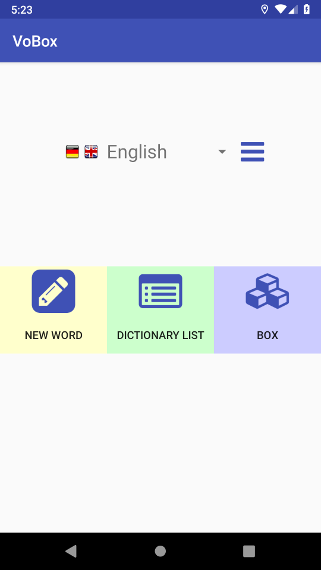

# VoBox

create and learn your own vocabulary with card boxes

An Android app for learning vocabulary. You can add your own list of dictionaries to learn.
Each word mapping is saved in a card. The cards are organized in card boxes. You can test
yourself. If your answers are right, the cards are placed in upper boxes, otherwise they
are moved downward.



Create your own dictionaries and improve your vocabulary with integrated training and tests. 
You are learning a new language, reading a book with unknown words, preparing for an exam in 
school or you are on holiday abroad? VoBox organizes new vocabulary and places them in card boxes. 
Test yourself, for every correct answer the card is placed in a higher card box. Check your 
progress simply by the number of cards in each box. Create as many dictionaries as you like 
and configure their languages as well as the number of card boxes. With VoBox you can

- add own word pairs
- search in word list 
- share dictionaries via file export and import
- import dictionaries from CSV file
- create dictionaries with arbitrary language mapping
- train vocabulary without effect on word levels
- test vocabulary, right answers lead to level up, wrong answers to level down

VoBox is open source software, feel free to check it out at https://github.com/CarstenKarbach/VoBox.
It comes free of charge and without advertisement. It can be used entirely locally and does not 
require a network connection.

## Use Cases

This app can be used for

- offline vocabularies for different languages
- learning sets of technical terms for exams

## Features

The app supports the following additional features

- localization in English and German
 

## Getting Started

This project is an Android Studio (`>=3.3`) project using Gradle as build tool.
Clone the repository and open it with Android Studio to start with your own modifications.

```
git clone https://github.com/CarstenKarbach/VoBox
```

In Android Studio click on `Build->Make Module ... app` and wait for Gradle to build the app.
Afterward, run the app on your target device by using the play button in the top menu bar.

This project and all its resources are licensed under the [GNU General Public License v2.0](./LICENSE).

## Manual

This section serves as short user manual for key functions of the app.

### Create your own dictionary

You can create as many dictionaries as you like. E.g. for every language combination you would like to learn such
as `English - French` or `Russian - Swedish` and even multiple dictionaries for the same langauge combination, e.g.
for multiple chapters of a book.

New dictionaries are created by starting on the start screen. Click on the three blue bars next to the currently
selected dictionary.


From here, click on `new` for creating a new dictionary.


Choose a name, the base language and the language you are learning. Configure the number of
card boxes and click on `ADD`. With that your new dictionary is created and you can start adding vocabulary.

### Import dictionaries

Adding hundreds of words on your mobile phone can be tedious work. Therefore, VoBox allows
importing dictionaries created with spread sheets (e.g. with LibreOffice or Microsoft Office). To import a
dictionary, create a CSV file in the format described below, then send it to your phone and open the file
with the VoBox app.

A dictionary in a spread sheet should look like this:

| Deutsch  | Englisch |
| -------- | -------- |
| ja       | yes      |
| nein     | no       |
| nur      | just     |
| ein      | a        |
| Beispiel | example  |

The first row needs to hold the language names. In the example above `Deutsch` is the base language
and `Englisch` the language, which you would like to learn. These languages can be adapted while importing
the dictionary into VoBox. You could also use `Language 1` and `Language 2` and choose the languages manually
while importing, but the first row is required. Every following row holds a pair of words, the word in the first
language in the first column, followed by its translation in the second column. 

This file needs to be stored as CSV file with these properties:
- Encoding: `UTF-8`
- Delimiter between cells: `;`
- File ending: `.csv`

The above example should look like this in a plain text editor:

```
Deutsch;Englisch
ja;yes
nein;no
nur;just
ein;a
Beispiel;example
```

Send this file to your mobile device and open it with VoBox. You can import it in two modes:
- as new dictionary: a new dictionary is created with the imported words
- merge into dictionary: choose an existing dictionary and add new words into it

An example dictionary to import can be found here: [de_en.csv](docs/example_dictionaries/de_en.csv)

This is a list of currently supported languages (use the German language names in the first row of your spread sheet):
- Bulgarisch
- Dänisch
- Deutsch
- Englisch
- Estnisch
- Finnisch
- Französisch
- Griechisch
- Hindi
- Irisch
- Italienisch
- Kroatisch
- Litauisch
- Maltesisch
- Mandarin
- Niederländisch
- Polnisch
- Portugiesisch
- Rumänisch
- Russisch
- Schwedisch
- Slowakisch
- Slowenisch
- Spanisch
- Tschechisch
- Ungarisch
- Andere

If you would like to have a language added, just send me a message or even better fork this repository, add the language and
submit a merge request. To start with, the list of languages is defined in [languages.xml](app/src/main/res/values/languages.xml),
language flags are placed into the [drawable](app/src/main/res/drawable) folder and the mapping of language to corresponding 
drawable image is also configured in the [languages.xml](app/src/main/res/values/languages.xml) file.

#### Creating a CSV file

Creating a CSV file with a spread sheet should roughly look like this:

- 1. Create your table with words in two columns, first row containing the language names


- 2. Store the file as CSV with the properties given above


#### Import in action

Once the CSV file is send to your device, you can open and import it into VoBox. Please, find a step by step
guide for importing a file below:

- 1. Find the file on your device and select it


- 2. Choose the import mode for your dictionary


- 3. Configure your dictionary


- 4. Start learning with your new dictionary


- 5. Edit, manage, search in your dictionary


